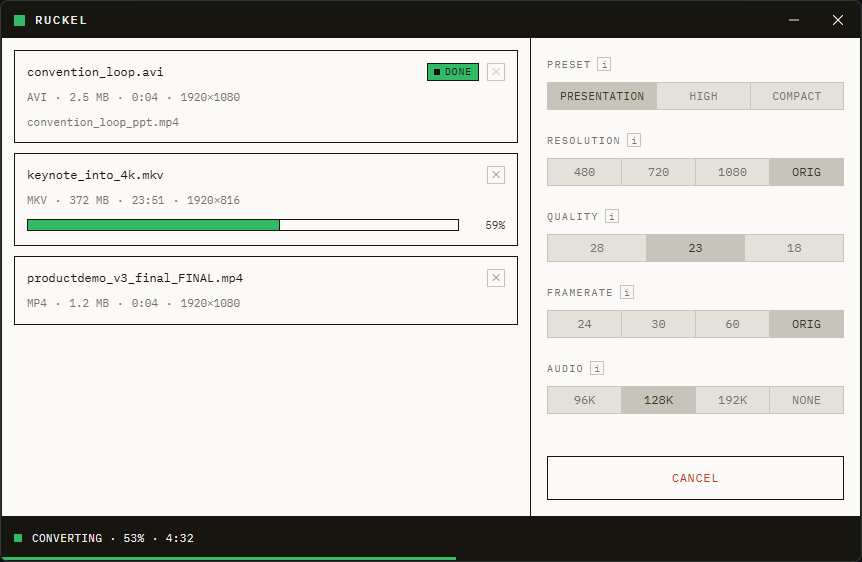

# Ruckel

[](https://github.com/Sauerbac/Ruckel/actions/workflows/build.yml)

Convert videos into PowerPoint-friendly MP4s.



## What it does

Drop a video file — or a whole folder — onto Ruckel and each video is transcoded to an
MP4 that PowerPoint embeds and plays without fuss: H.264/AAC with faststart, so playback
starts instantly instead of after a full file scan. The result is written next to the
original as `<name>_ppt.mp4`; your source files are never touched.

Three presets (**Presentation**, **High Quality**, **Compact**) cover the usual cases,
with four knobs — resolution, quality, framerate cap, audio bitrate — if you want to
tweak.

## Download

Grab `ruckel.exe` from the [latest release](https://github.com/Sauerbac/Ruckel/releases/latest).
It's a single file — no installer, nothing else to set up. Windows only.

## Development

Ruckel is a [Tauri v2](https://v2.tauri.app/) app: Svelte + Tailwind frontend, Rust
backend with FFmpeg's libav\* libraries linked in-process.

One-time setup — build the pinned static FFmpeg libraries (see
[`scripts/build-ffmpeg/README.md`](scripts/build-ffmpeg/README.md) for prerequisites):

```powershell
pwsh scripts/build-ffmpeg/build.ps1
```

Then the usual:

```powershell
npm install
npm run tauri dev      # run the app
npm run check          # typecheck
cargo test --manifest-path src-tauri/Cargo.toml
```

Architecture and domain vocabulary live in [`CONTEXT.md`](CONTEXT.md); decisions are
recorded in [`docs/adr/`](docs/adr/).

## License

[GPLv3](LICENSE). The bundled FFmpeg build is pinned and documented in
`src-tauri/ffmpeg-build-manifest.json`.
